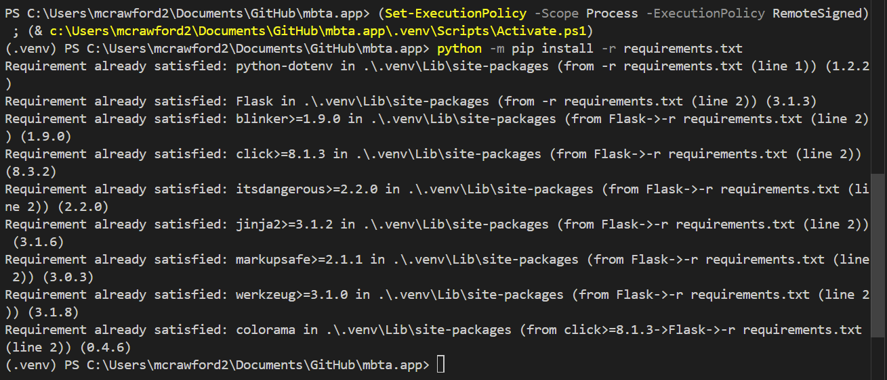
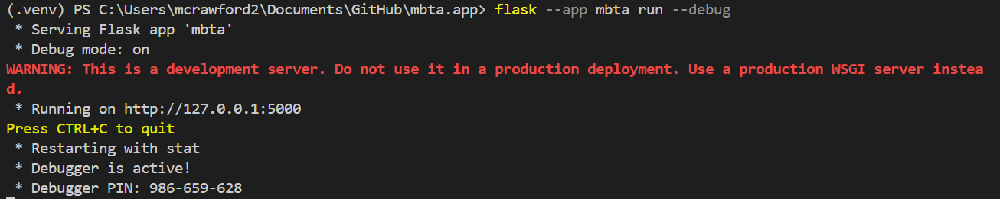
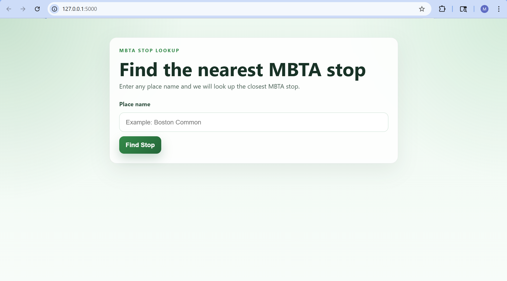
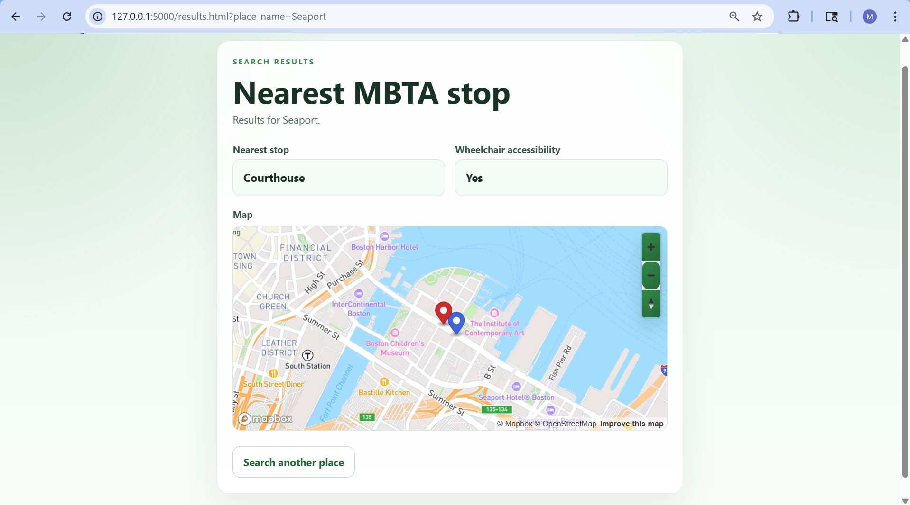

# What does this project do?
A web app that finds the nearest T stop from any Boston location, and includes a map with location and T stop pinpoints.

# Setup instructions
1. Install dependencies if needed: python -m pip install -r requirements.txt
2. Start the Flask app: flask --app mbta run --debug
3. Open: http://127.0.0.1:5000/

# Files directory
- app.py - Flask app with two core functions:
    - get_location() calls the Mapbox Geocoding API to convert a place name into latitude/longitude coordinates
    - get_nearest_stop() calls the MBTA API to find the closest stop to those coordinates
- index.html - search form where users enter a place name
- results.html - displays results and renders the Mapbox GL JS map with pins for both locations
- styles.css - styles the UI with a green MBTA-inspired theme

# Screenshots
1. 
2. 
3. 
4. 